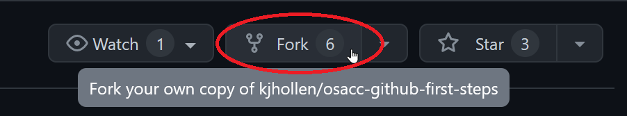

# osacc-github-first-steps
Repository for practicing and learning GitHub at OSACC 2024.
GitHub is a tool for managing contributions to an open source project.
You can use it to keep track of different versions of your code, track issues, plan projects, and write documentation (among other things).
In this workshop, we'll cover some basics of getting to know GitHub:

- browsing and filing issues
- checking out and modifying your own copy of the code
- submitting a pull request to resolve an issue

## Browsing and Filing Issues
Issues are used to track bugs, feature requests, and other tasks in a project.
Community members may be assigned an issue, indicating that they are responsible for fixing or otherwise taking care of it.
Issues may also be organized using labels—sometimes, a project may have a label to help new contributors find issues that are easier to fix to encourage them to join the project.

### Searching Existing Issues
You can view existing issues under the Issues tab.
Browsing open issues is a great way to get to know a project.
If you think you've found a bug in a project, it's a good idea to search the open issues to see if anyone else has already reported the issue.
This not only prevents you from filing a duplicate issue (creating more work for the maintainer of the project), but also may allow you to find a workaround to the issue submitted by another community member before a solution is published by the maintainers.

### Filing an issue

To open a new issue, click on the Issues tab and then find the green New Issue button.
Write a description of your proposed changes or the bug that you found.

When filing a bug report, it's important to include:
- the expected outcome (a description of what you think should have happened)
- the actual outcome (what happens instead of what you expected)
- steps to reproduce the problem, as succinctly as possible
- any other information the project asks for (e.g. what browser and/or operating system you are using when you encounter the bug)

Many projects have a template for filing a new issue, which will describe their guidelines for submitting a good issue report.
Be sure to follow their instructions!

When filing a feature request, it's important to include:
- a description of the change or new feature you'd like to see
- why you think it is beneficial to the project

### Configuring Issue Template 
Issue templates are useful for making sure users add required information to bug reports and feature requests. Information for creating an issue template is at this [GitHub Documentation Page](https://docs.github.com/en/communities/using-templates-to-encourage-useful-issues-and-pull-requests/configuring-issue-templates-for-your-repository)

## Checking out and modifying your own copy of the code

### Downloading your own copy of the code

### Saving changes to your code on your computer

### Editing files in the browser

## Submitting a pull request to resolve an issue

### Make a copy of the project to your own GitHub account by forking the project
Click the "Fork" button on the top right of the project page to make a copy of the project to your own GitHub account.

### Upload your changes by pushing to your remote repository

### Ask for your changes to be added to the project with a pull request

### Creating a pull request from a fork

Navigate to the original repository where you created your fork.

Above the list of files, in the yellow banner, click Compare & pull request to create a pull request for the associated branch.

On the page to create a new pull request, click compare across forks.
In the "base branch" dropdown menu, select the branch of the upstream repository you'd like to merge changes into.
In the "head fork" dropdown menu, select your fork, then use the "compare branch" drop-down menu to select the branch you made your changes in.
Type a title and description for your pull request.
On user-owned forks, if you want to allow anyone with push access to the upstream repository to make changes to your pull request, select Allow edits from maintainers.
To create a pull request that is ready for review, click Create Pull Request. To create a draft pull request, use the drop-down and select Create Draft Pull Request, then click Draft Pull Request. 
