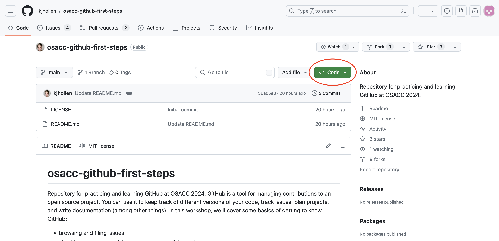
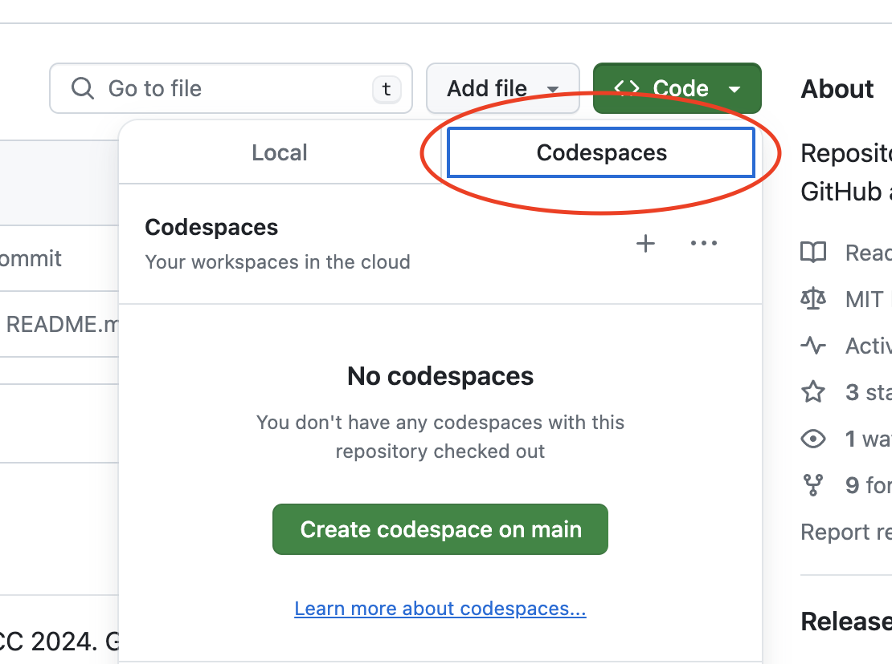
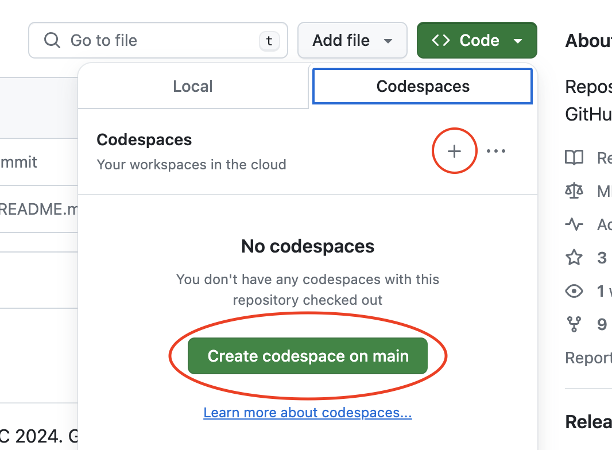

# osacc-github-first-steps
Repository for practicing and learning GitHub at OSACC 2024.
GitHub is a tool for managing contributions to an open source project.
You can use it to keep track of different versions of your code, track issues, plan projects, and write documentation (among other things).
In this workshop, we'll cover some basics of getting to know GitHub:

- browsing and filing issues
- checking out and modifying your own copy of the code
- submitting a pull request to resolve an issue

## Browsing and Filing Issues
Issues are used to track bugs, feature requests, and other tasks in a project.
Community members may be assigned an issue, indicating that they are responsible for fixing or otherwise taking care of it.
Issues may also be organized using labels—sometimes, a project may have a label to help new contributors find issues that are easier to fix to encourage them to join the project.

### Searching Existing Issues
You can view existing issues under the Issues tab.
Browsing open issues is a great way to get to know a project.
If you think you've found a bug in a project, it's a good idea to search the open issues to see if anyone else has already reported the issue.
This not only prevents you from filing a duplicate issue (creating more work for the maintainer of the project), but also may allow you to find a workaround to the issue submitted by another community member before a solution is published by the maintainers.

### Filing an issue

To open a new issue, click on the Issues tab and then find the green New Issue button.
Write a description of your proposed changes or the bug that you found.

When filing a bug report, it's important to include:
- the expected outcome (a description of what you think should have happened)
- the actual outcome (what happens instead of what you expected)
- steps to reproduce the problem, as succinctly as possible
- any other information the project asks for (e.g. what browser and/or operating system you are using when you encounter the bug)

Many projects have a template for filing a new issue, which will describe their guidelines for submitting a good issue report.
Be sure to follow their instructions!

When filing a feature request, it's important to include:
- a description of the change or new feature you'd like to see
- why you think it is beneficial to the project

## Checking out and modifying your own copy of the code

### Downloading your own copy of the code

### Saving changes to your code on your computer

### Editing files in the browser
Why edit your code in the browser?

 - Convenience: Modify your code from virtually any device! If you're using a public computer, own a device without the bandwidth to download the project or simply want to use smaller devices like iPads and tablets, coding from the web may be for you.
   - As a bonus, everything autosaves on the web, so feel free to step away and return to your project without fear of losing your hard work!
 - Privacy: Concerned about the privacy and security risks associated with downloading to your personal device? Working in the browser may be the route for you!
 - Sustainability: You can turn off the VM, which both saves energy and potentially saves you money (learn more below)

Many users will want simply leverage GitHub's built in online code editor called Codespaces. Simply click on Code

.

Click Codespaces

.

Make a new environment (either click the plus or the large green button)

.

In addition to Codespaces, you may interact with repositories outside GitHub and Gitpod is similarly an application that allows users to open and edit Git repositories on the go without local downloads. To start, register and link you Gitpod account to your Github here: https://www.gitpod.io/. Once completed, you will be asked to input the link to your Git repository and desired code editor. And now, you are free to edit on the go with anything!

In either case, the code editor is running a full fledged machine in the cloud! If you click on terminal at the bottom of the screen, you can even execute commands.

When you are ready to send up your changes, you can open a new branch

.

Then, make a commit on the left side of the screen.

.

When you are done, click on codespaces (or equivalent) in the bottom left to and click "Stop Current Codespace" or "Stop Current VM" to turn off the machine in the cloud that is running your code editor. You can come back to it later! However, after some time (a few days) it will be deleted.

## Submitting a pull request to resolve an issue

### Make a copy of the project to your own GitHub account by forking the project

### Upload your changes by pushing to your remote repository

### Ask for your changes to be added to the project with a pull request
